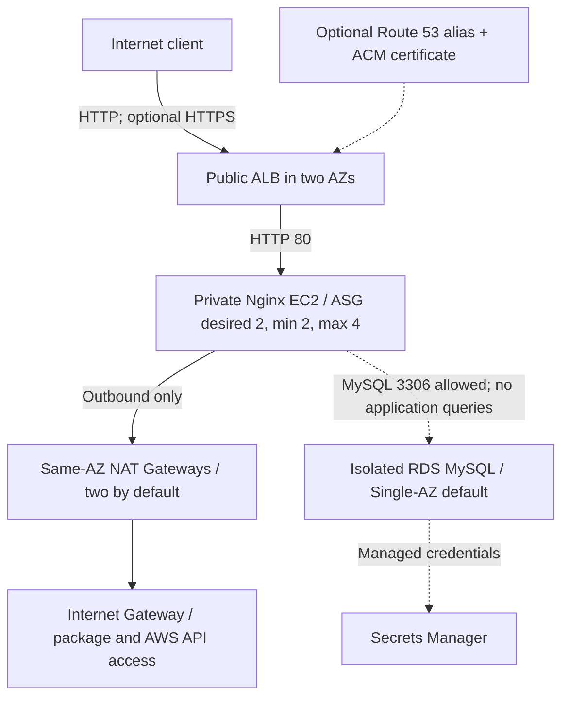

# AWS Three-Tier Infrastructure Lab

[](https://github.com/expertnafees-hub/aws-three-tier-architecture/actions/workflows/terraform-ci.yml)

A **Junior AWS DevOps portfolio project** built with Terraform: public ALB, private Auto Scaling EC2 instances and isolated RDS MySQL. The application is a static Nginx page. **It does not query RDS or retrieve a secret.** This demonstrates infrastructure configuration, not an enterprise production system.

## Evidence status

The audited main commit `1c68c55` passed GitHub Actions formatting and validation ([run](https://github.com/expertnafees-hub/aws-three-tier-architecture/actions/runs/35141561165)). Its tfsec job reported **15 potential problems** and passed because `soft_fail` was enabled. CI remains explicitly advisory for security; a green badge does not mean no findings. The badge follows main, not necessarily the branch being viewed.

No deployment output or measured recovery-test results were found in that snapshot. This audit branch proposes fixes; passing CI is not evidence of AWS deployment, database integration, availability or successful recovery.

- [Instructor Review Pack and architecture](docs/INSTRUCTOR_REVIEW_PACK.md)
- [Audited main architecture snapshot](docs/ARCHITECTURE_MAIN.md)
- [Detailed audit and remaining limitations](docs/AUDIT.md)
- [Controlled failure-test procedure](docs/CHAOS_RECOVERY_TEST.md)

## Configured architecture



The two-AZ DB subnet group does not imply Multi-AZ RDS. Route 53 performs DNS resolution; ACM supplies a certificate. Neither is an inline HTTP proxy. See the review pack for subnet CIDRs and security boundaries.

## Implemented in Terraform

| Component | Exact scope |
| --- | --- |
| VPC | `10.0.0.0/16`; two subnets per tier by default; VPC DNS; public IGW routes, same-AZ NAT app routes, DB local routes only |
| ALB | Internet-facing HTTP listener; port-80 target group, `/` health checks requiring 200; invalid-header dropping; app-subnet-only TCP-80 egress |
| EC2 / ASG | Private `t3.micro` instances; reviewed AL2023 AMI input; IMDSv2, encrypted gp3 root disks, SSM role and detailed monitoring; ELB health replacement; numeric template version and rolling refresh |
| Scaling | Min 2 / desired 2 / max 4. No CPU/request-based scaling policy; CPU alarm sends notifications only |
| RDS | MySQL 8.0 family, `db.t3.micro`, 20 GiB, encrypted storage, public access disabled, seven-day backup retention |
| Secrets / IAM | RDS-managed master password; SSM managed policy; optional exact-secret-ARN read policy, disabled by default |
| Security groups | Internet to ALB on 80/443; ALB to app on 80; app to DB on 3306; no SSH; app outbound access remains broad |
| CloudWatch | Four alarms: target 5xx, p95 latency, unhealthy hosts, ASG CPU; ALB/EC2 dashboard and SNS topic; no RDS alarms or log collection |
| CI | Terraform fmt/init/validate, shell syntax, advisory tfsec. No plan/apply or deployment pipeline |

## Optional features

| Input | Default | Effect |
| --- | --- | --- |
| `db_multi_az` | `false` | Requests an RDS standby for Multi-AZ availability |
| `enable_custom_domain` | `false` | Existing public hosted-zone lookup, ACM certificate and DNS validation, HTTPS listener, HTTP redirect, Route 53 apex alias |
| `domain_name` | Empty | Required in custom-domain mode; must match an existing delegated public hosted zone; no trailing dot |
| `alarm_email` | Empty | SNS email subscription; recipient confirmation required |
| `enable_demo_master_secret_access` | `false` | Lab-only EC2 permission to read the master secret; unused by Nginx |

HTTPS terminates at the ALB; backend traffic remains HTTP. No custom KMS key or key policy is implemented. Service-managed encryption must not be presented as a custom KMS design.

## Validate, plan and deploy deliberately

Prerequisites: Terraform >= 1.5, AWS CLI v2, an authorized sandbox and a reviewed **Amazon Linux 2023 x86_64 AMI with `/dev/xvda` root and SSM agent** in the chosen region. CI uses Terraform 1.8.5 and AWS provider 5.100.0. The AMI input has no default: a regex only checks ID syntax, not ownership, availability or compatibility.

```bash
terraform init -backend=false
terraform fmt -check -recursive
terraform validate
bash -n scripts/chaos_test.sh
```

Before any deployment, supply `ec2_ami_id` and `aws_region` in a local ignored `terraform.tfvars`, check CIDR containment/overlap, confirm engine/class availability and review costs. For a new lab, choose a project name such as `three-tier-lab`; the legacy default `three-tier-prod` is retained to avoid replacing existing named resources and is **not** a production-readiness claim.

```bash
aws sts get-caller-identity
terraform plan -out=tfplan
terraform show tfplan
# Only after reviewing the actual plan and costs:
terraform apply tfplan
```

No command above has been represented as a successful deployment. NAT Gateways, ALB, EC2/EBS, RDS/backups, Secrets Manager and detailed monitoring can incur charges. This is not a free-tier guarantee.

## State and repeatability

Local state is the default. Configure an encrypted remote backend with locking before shared or long-lived use. State, saved plans and local tfvars must not be committed. Generate and review `.terraform.lock.hcl` with `terraform init` and commit it; the current provider pin alone is not a checksum lock. Bootstrap runs `dnf update`, so package versions are not immutable even when the AMI is pinned.

## Known limitations

- Static demo only; no application-to-database integration or restricted DB application user.
- RDS is Single-AZ by default; HTTP is the default public protocol. Do not put sensitive data in the demo.
- Refresh allows 50% healthy capacity. There is no load-driven scaling, baked image, automatic rollback or zero-downtime guarantee.
- Nginx `/` health checks do not check DB or SSM readiness. Bootstrap depends on NAT/package repositories and can exceed the 300-second grace period.
- App egress is broad; demo instance IDs/AZs are public for the probe. No WAF, VPC endpoints, flow logs, ALB access logs, custom KMS policy, RDS alarms, log agent, or cross-region recovery.
- SNS topic encryption is not configured. Email delivery is unverified and requires subscription confirmation. Alarms treat missing data as non-breaching.
- Backups are configured, but restoration has not been demonstrated. RDS deletion protection is off and final snapshot is skipped.
- CI security findings remain visible and non-blocking; no AWS plan/apply or runtime test runs in CI.

## Failure drill and cleanup

The [runbook](docs/CHAOS_RECOVERY_TEST.md) describes a controlled single-instance termination. The probe sends serial requests with a one-second pause after each response (up to five seconds per request); it is not a load test or a zero-downtime proof. Preserve real timestamps and target/ASG observations before claiming results.

```bash
terraform plan -destroy -out=destroy.tfplan
terraform show destroy.tfplan
# Destructive: only after reviewing the actual plan.
terraform apply destroy.tfplan
```

Destroy skips a final DB snapshot. Explicitly back up any data you need first. Verify retained backups, EIPs, NAT Gateways, DNS records and other billable resources afterward.

## Source map

`vpc.tf` routes/subnets; `security_groups.tf` traffic rules; `alb.tf` listeners/targets; `compute.tf` launch template/ASG/bootstrap; `database.tf` RDS; `iam.tf` instance permissions; `dns_acm.tf` optional DNS/TLS; `cloudwatch.tf` metrics/SNS; `variables.tf` inputs; `outputs.tf` identifiers; `providers.tf` versions; `.github/workflows/terraform-ci.yml` CI.

**Author:** Nafees Ur Rehman · AWS DevOps / Cloud Engineering portfolio · [MIT license](LICENSE)
