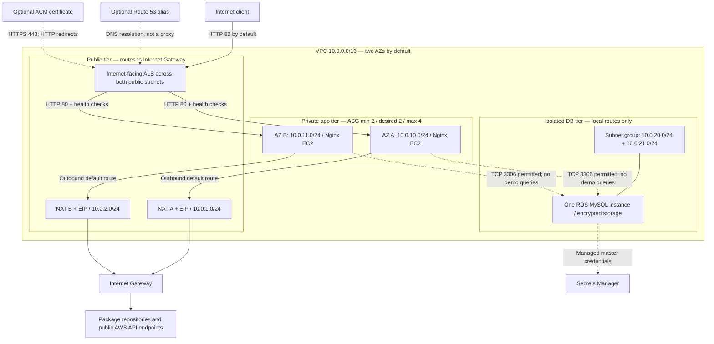

# Current main architecture — audited snapshot

Source: commit [`1c68c55f5c4308cdd2837ebde8528c28355f28e4`](https://github.com/expertnafees-hub/aws-three-tier-architecture/tree/1c68c55f5c4308cdd2837ebde8528c28355f28e4), reviewed 2026-09-16. This diagram is a code-derived design, **not a deployment diagram or test result**.

The ASG selects subnets across two AZs; the nodes illustrate intended distribution, not evidence of live instances. RDS uses a two-AZ subnet group but is **Single-AZ by default**; `db_multi_az = true` requests a standby. The code does not select a fixed primary DB AZ. There is no separate web-server fleet: the public tier is the ALB, and Nginx is the application-tier demo.

Solid arrows show configured request/egress paths, not observed traffic. Dashed arrows show optional configuration, credentials management, or permitted-but-unused DB connectivity. Route 53 resolves names and ACM supplies the certificate; neither is an inline network hop. ALB-to-EC2 traffic remains HTTP even with external HTTPS.

SSM administration uses the instance role, SSM agent and outbound NAT access; there are no SSH rules or VPC endpoints. Four CloudWatch alarms cover target 5xx, target p95 latency, unhealthy target count and ASG CPU. They publish to SNS; email needs an address and subscription confirmation. The dashboard covers ALB and EC2, not RDS or application logs.

## Main-specific caveats

- EC2 can read the RDS master secret by default, but the demo never reads it.
- Launch template uses `$Latest`; edits do not reliably trigger the declared refresh.
- Root EBS encryption and EC2 detailed monitoring are not explicitly configured.
- ALB and app egress are unrestricted; public subnets auto-assign IPv4 to instances launched there (the app template separately disables it).
- RDS backup retention is omitted; no configured backup/restore evidence exists.
- The checked-in CI validation passed, while its advisory tfsec scan reported 15 potential problems.
- Same-AZ NAT routing holds for default equal subnet lists; arbitrary unequal lists can select a NAT in another AZ.

See [audit](AUDIT.md) for evidence and proposed fixes. See [review pack](INSTRUCTOR_REVIEW_PACK.md) for the proposed branch state.
