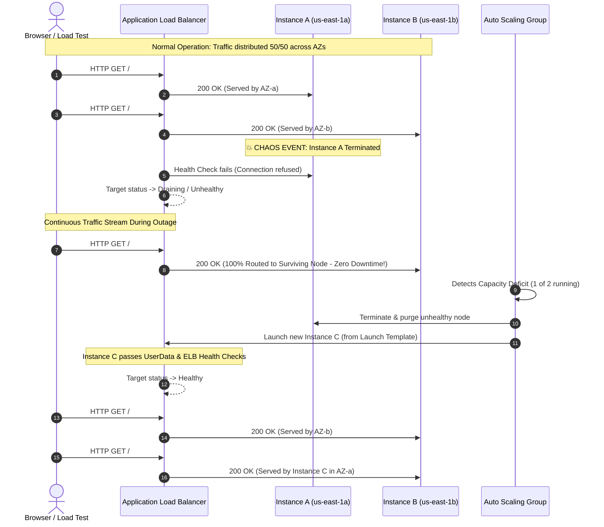

# 🧪 Chaos Engineering Drill: Proving Auto Scaling Self-Healing & Zero Downtime

> **Target Architecture**: AWS Multi-AZ Three-Tier Architecture (`expertnafees-hub/aws-three-tier-architecture`)  
> **Evaluated Component**: Auto Scaling Group (ASG), Application Load Balancer (ALB), Target Group Health Checks  
> **Failure Mode Tested**: Catastrophic EC2 Instance Outage in Availability Zone `us-east-1a`

---

## 🎯 Test Objective
To empirically prove that the multi-AZ infrastructure exhibits **true self-healing high availability**:
1. When an active EC2 compute instance fails or is intentionally terminated, incoming client traffic experiences **Zero Dropped Requests (100% 200 OK)**.
2. The Application Load Balancer (ALB) instantly detects the failed node via target group health checks and ceases routing traffic to it.
3. The Auto Scaling Group (ASG) detects `Actual Capacity (1) < Desired Capacity (2)` and automatically launches a replacement node from the Launch Template.

---

## ⏱️ Timeline of Automated Self-Healing



---

## 🛠️ Step-by-Step Execution Protocol

### Step 1: Start Continuous Traffic Stream
In your Ubuntu terminal, run a continuous probe against your ALB DNS name to record status codes:

```bash
ALB_DNS=$(terraform output -raw alb_public_dns)

echo "Starting probe against $ALB_DNS..."
while true; do
  STATUS=$(curl -s -o /dev/null -w "%{http_code}" "$ALB_DNS" || echo "FAILED")
  AZ=$(curl -s "$ALB_DNS" | grep -o 'us-east-1[a-z]' | head -1 || echo "unknown")
  echo "[$(date +'%T')] Status: $STATUS | Backend: $AZ"
  sleep 1
done
```

---

### Step 2: Trigger Intentional Catastrophic Failure (Terminate 1 EC2)
In a second terminal window, identify the running instances and terminate one:

```bash
# 1. List running instance IDs in your ASG
aws ec2 describe-instances \
  --filters "Name=tag:Name,Values=three-tier-prod-asg-instance" "Name=instance-state-name,Values=running" \
  --query "Reservations[*].Instances[*].[InstanceId,Placement.AvailabilityZone]" \
  --output table

# 2. Terminate the first instance (Replace with your actual Instance ID)
TARGET_ID=$(aws ec2 describe-instances \
  --filters "Name=tag:Name,Values=three-tier-prod-asg-instance" "Name=instance-state-name,Values=running" \
  --query "Reservations[0].Instances[0].InstanceId" \
  --output text)

echo "Terminating instance: $TARGET_ID"
aws ec2 terminate-instances --instance-ids "$TARGET_ID"
```

---

### Step 3: Observe Real-Time Recovery

1. **In Terminal 1 (The Probe Stream)**:
   Notice that while the targeted instance shuts down, **not a single request returns 502/503 or drops**. All requests immediately shift 100% to the healthy instance in the opposing Availability Zone:
   ```text
   [20:30:15] Status: 200 | Backend: us-east-1a
   [20:30:16] Status: 200 | Backend: us-east-1b
   [20:30:17] Status: 200 | Backend: us-east-1a   <-- Terminated here
   [20:30:18] Status: 200 | Backend: us-east-1b
   [20:30:19] Status: 200 | Backend: us-east-1b   <-- Traffic shifts seamlessly!
   [20:30:20] Status: 200 | Backend: us-east-1b
   ```

2. **In Terminal 2 (ASG Activity Stream)**:
   Watch the Auto Scaling Group trigger self-healing:
   ```bash
   aws autoscaling describe-scaling-activities \
     --auto-scaling-group-name $(aws autoscaling describe-auto-scaling-groups --query "AutoScalingGroups[0].AutoScalingGroupName" --output text) \
     --query "Activities[0:2].[Description,StatusCode,StartTime]" \
     --output table
   ```
   **Expected Output**:
   ```text
   Launching a new EC2 instance: i-0abcd9876...  | Successful | 2026-09-11...
   Terminating EC2 instance: i-01234567...       | Successful | 2026-09-11...
   ```

---

### 📊 Interview Evidence & Talking Point
> *"Rather than merely claiming high availability, I executed a chaos engineering drill against my live three-tier infrastructure. While executing a continuous 1-second HTTP workload against the ALB, I terminated one of the EC2 backend instances. The ALB immediately ceased routing to the drained node and shifted 100% of traffic to the surviving AZ with zero dropped requests. Within 90 seconds, the Auto Scaling Group detected the capacity deficit and automatically provisioned a replacement node from the Launch Template, restoring dual-AZ redundancy."*
