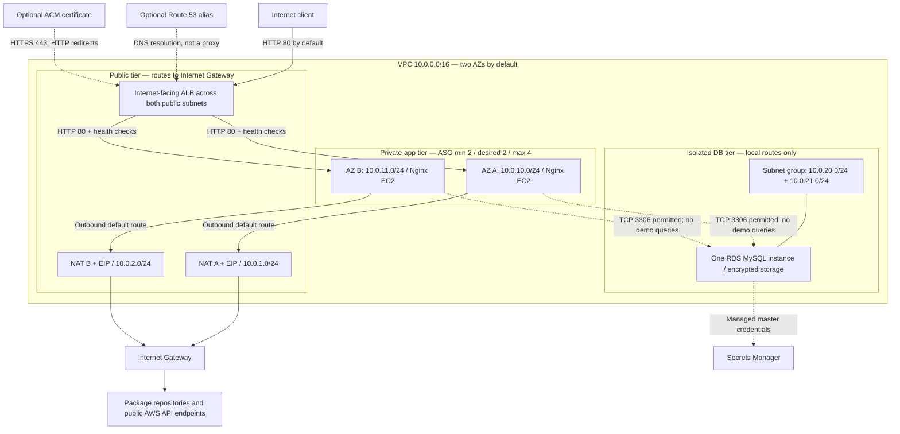

# Instructor Review Pack

**Nafees Ur Rehman · AWS re/Start · Junior AWS DevOps portfolio**  
Review date: 2026-09-16

## Scope and evidence boundary

This pack describes the **proposed audit branch**, not an already-merged or deployed system. The unchanged topology of the audited `main` snapshot is documented separately in [ARCHITECTURE_MAIN.md](ARCHITECTURE_MAIN.md). Code shows implementation intent; CI validation does not prove AWS deployment. No apply output, target-health captures, DB queries, or recorded failure-drill results were found in the audited repository.

## Short project summary

I implemented Terraform for a three-tier AWS infrastructure lab: a public ALB, private Nginx EC2 instances managed by an Auto Scaling Group, and an isolated RDS MySQL database. The project explores routing, security groups, IAM, managed credentials, health replacement and basic monitoring. The Nginx page is static and does not use the database. I want feedback on the design and help planning evidence-based deployment and failure tests.

## Architecture

The ASG selects subnets across two AZs; the nodes illustrate intended distribution, not evidence of live instances. RDS uses a two-AZ subnet group but is **Single-AZ by default**; `db_multi_az = true` requests a standby. The code does not select a fixed primary DB AZ. There is no separate web-server fleet: the public tier is the ALB, and Nginx is the application-tier demo.

Solid arrows show configured request/egress paths, not observed traffic. Dashed arrows show optional configuration, credentials management, or permitted-but-unused DB connectivity. Route 53 resolves names and ACM supplies the certificate; neither is an inline network hop. ALB-to-EC2 traffic remains HTTP even with external HTTPS.

SSM administration uses the instance role, SSM agent and outbound NAT access; there are no SSH rules or VPC endpoints. Four CloudWatch alarms cover target 5xx, target p95 latency, unhealthy target count and ASG CPU. They publish to SNS; email needs an address and subscription confirmation. The dashboard covers ALB and EC2, not RDS or application logs.

## What is implemented in this branch

| Area | Terraform implementation |
| --- | --- |
| Network | VPC DNS support; two public, two private app and two isolated DB subnets by default; IGW; two NAT Gateways/EIPs; same-index AZ-local private routes; equal-count guard |
| ALB | Internet-facing; HTTP default; target group on port 80; `/` health check requiring 200; invalid-header dropping; egress only to private app subnet CIDRs on TCP 80 |
| Compute | `t3.micro`; min/desired 2, max 4; ELB health checks, 300-second grace; numeric launch-template version; rolling refresh allowing 50% healthy capacity; no load-driven scaling policy |
| EC2 security | No public IP; no SSH ingress; IMDSv2 required, hop limit 1; encrypted gp3 root disk; reviewed AL2023 x86_64 AMI required; detailed monitoring enabled |
| Bootstrap | Installs/updates packages, writes Nginx page, validates Nginx config, starts Nginx and SSM agent; waits for routing dependencies |
| Database | MySQL 8.0 family, `db.t3.micro`, 20 GiB, encrypted, private, seven-day backup retention; Single-AZ default; deletion protection off; final snapshot skipped |
| Credentials | RDS-managed master secret; EC2 has SSM managed policy; master-secret read policy is scoped to one ARN and opt-in only |
| Monitoring | Four ALB/EC2 alarms, dashboard, SNS topic; no database alarms or log collection |
| CI and operations | Format/validate and shell syntax checks; pinned action commits and provider version; advisory tfsec; serial HTTP probe and a failure runbook |

## What is optional

- `db_multi_az = true`: requests RDS Multi-AZ at additional cost; not enabled in the default lab.
- `enable_custom_domain = true` plus `domain_name`: uses an existing public hosted zone of that name for ACM DNS validation and an apex ALB alias. Public DNS delegation must already work. External TLS 1.2/1.3 terminates at the ALB.
- `alarm_email`: creates an email subscription; the recipient must confirm it before notifications arrive.
- `enable_demo_master_secret_access = true`: learning-only access to the RDS master secret. The static demo does not need it. A real app needs a restricted database user and a dedicated application secret.

## Known limitations and honest trade-offs

1. This is three-tier **infrastructure**, not a working database-backed application. A healthy Nginx page cannot prove RDS health.
2. There is no deployment, restore, scaling, refresh or failure-test evidence. Successful static checks are not runtime verification.
3. ASG membership/replacement is configured; traffic-driven scaling is not. A max of four does not automatically scale the fleet to four.
4. Single-AZ RDS, a 50% minimum-healthy refresh and package installation at boot limit availability. Bootstrap can exceed its grace period; there is no baked AMI, staged deployment, rollback automation or zero-downtime guarantee.
5. Default HTTP is suitable only for a disposable, non-sensitive lab. App outbound access remains unrestricted. The public demo displays instance ID/AZ for the probe; private IP display was removed.
6. No custom KMS keys/key policies, WAF, flow logs, ALB access logs, CloudWatch agent, RDS alarms, distributed traces or cross-region DR. SNS topic encryption is not configured. Missing alarm data is treated as non-breaching.
7. Backups are configured but untested; destroy skips the final DB snapshot and deletion protection is off. Do not store valuable data.
8. Terraform uses local state. Provider version is pinned, but a reviewed `.terraform.lock.hcl` still needs to be generated and committed from `terraform init`.
9. tfsec is explicitly advisory with visible findings. It is not a security gate or an all-clear certificate.
10. NAT, ALB, EC2, EBS, RDS, backups, Secrets Manager, detailed monitoring and other resources can incur charges. No free-tier or monthly-cost guarantee is made.
11. MySQL engine availability, lifecycle/support charges and the chosen AMI must be checked for the target region before a real plan. CIDR containment and overlap still need review; the subnet-count guard is not a full network validator.

## Five questions for my AWS re/Start instructor

1. **Network isolation:** Can I walk you through an inbound request, an EC2 package download and a DB connection, and have you challenge which routes and security-group rules each needs?
2. **Failure behavior:** With two app instances, Single-AZ RDS and 50% minimum healthy refresh, which failures would interrupt service, and what precise measurements should I collect in a single-instance failure drill?
3. **Least privilege:** For a real database-backed demo, how should I create a restricted MySQL user, store its secret and prove EC2 cannot read the master credentials?
4. **Monitoring:** Which minimum RDS, ALB-generated-error and missing-data alarms should I add, and how should I safely test SNS delivery and backup restoration?
5. **Reproducibility:** What evidence would you require before calling this job-ready junior work: reviewed plan, remote state/locking, provider lock file, bootstrap logs, refresh test and cleanup proof?

## Review order

Read [README](../README.md), then [audit findings](AUDIT.md), then `vpc.tf`, `security_groups.tf`, `compute.tf`, `database.tf`, `iam.tf`, `alb.tf`, `dns_acm.tf`, `cloudwatch.tf` and CI. Discuss the [failure runbook](CHAOS_RECOVERY_TEST.md) before executing it in an authorized sandbox.

**Suggested positioning:** “Terraform AWS infrastructure lab demonstrating junior DevOps fundamentals, with explicit limitations and an evidence-first test plan.”
